# 🏗️ Architecture & Flow Diagrams — Interview Reference

---

## 🔥 End-to-End Request Lifecycle (All Layers)

*How a single API request flows from client to database and back — every layer touched.*

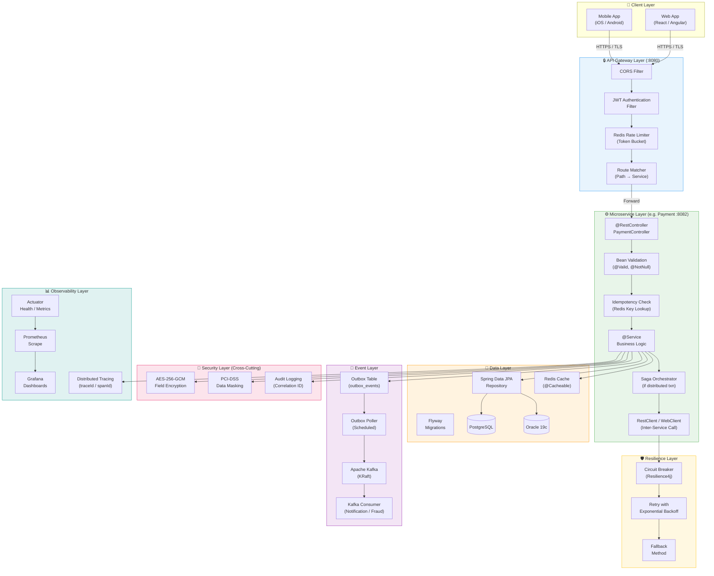

---

## 🏛️ Layered Architecture Stack

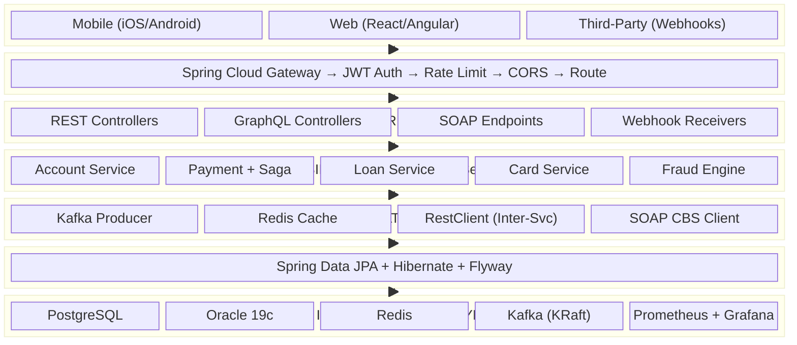

---

## 🔄 Complete Fund Transfer — End-to-End Through All Layers

*The most important flow in the entire platform — trace every layer a payment touches.*

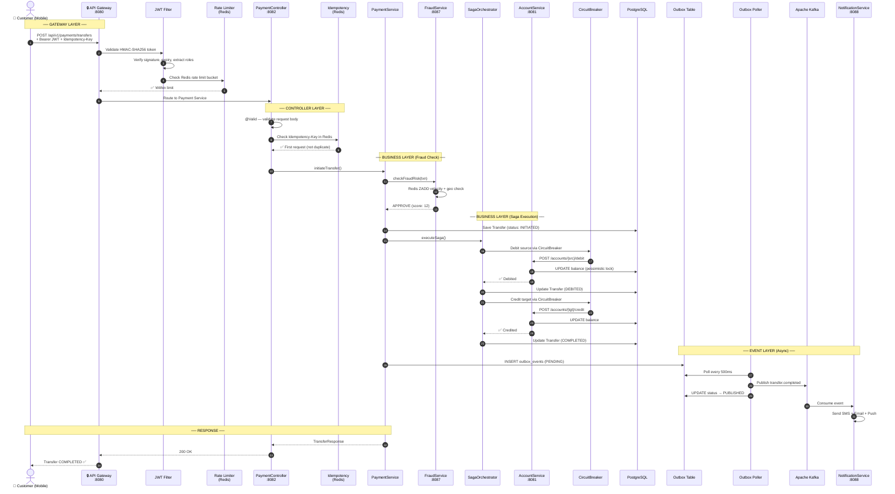

---

## 1. High-Level System Architecture

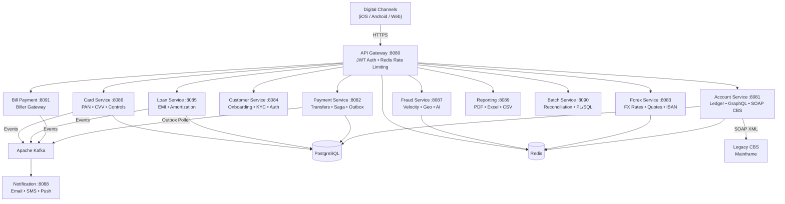

---

## 2. Fund Transfer — Saga Orchestrator Flow

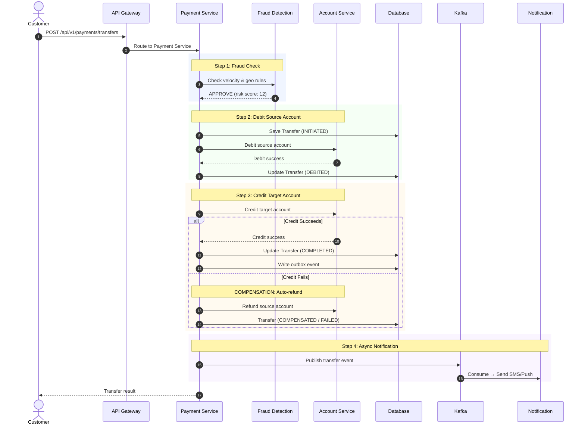

---

## 3. Transfer State Machine

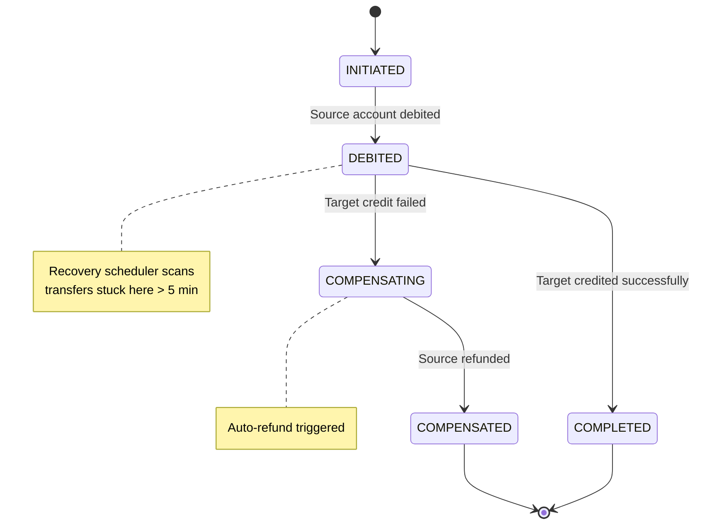

---

## 4. JWT Authentication & Token Lifecycle

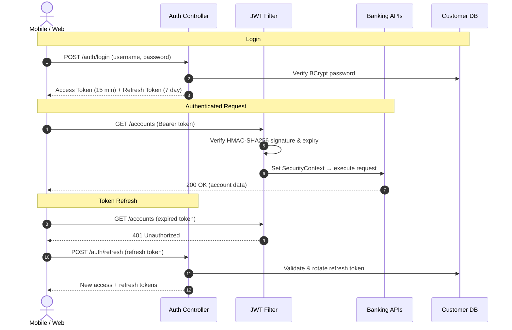

---

## 5. Event-Driven Architecture (Kafka + Outbox)

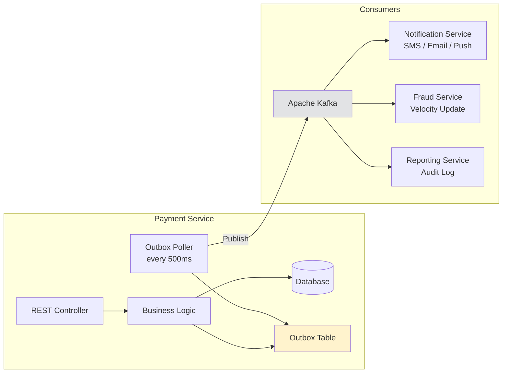

---

## 6. API Gateway — Rate Limiting & Routing

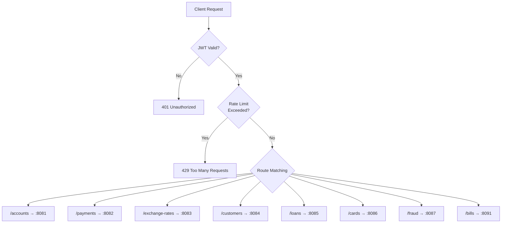

---

## 7. Fraud Detection — Real-Time Risk Scoring

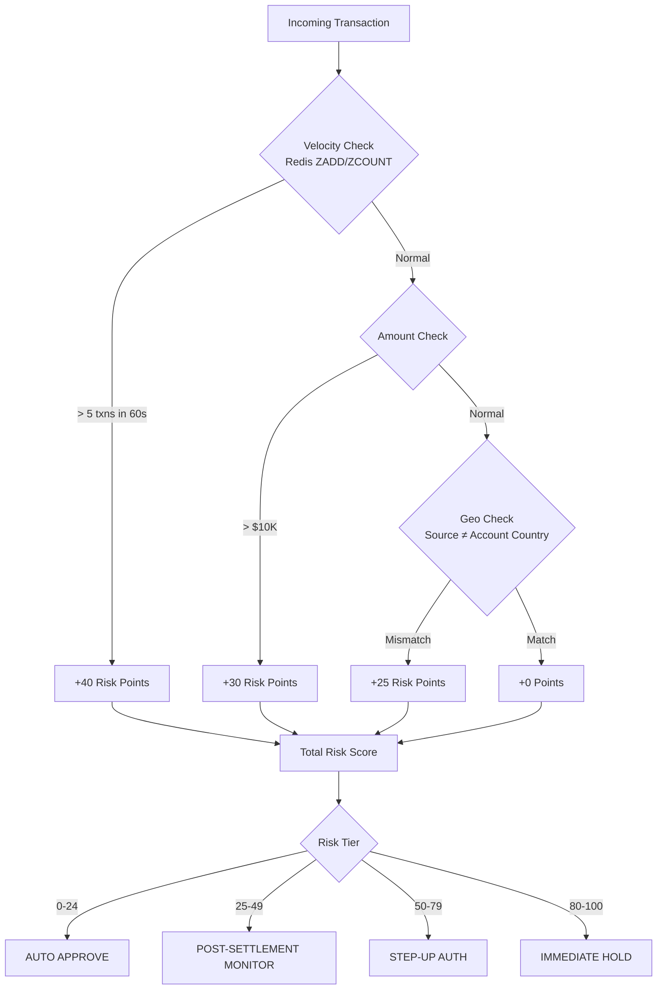

---

## 8. CI/CD Pipeline

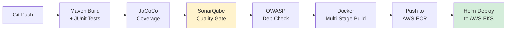

---

## 9. Reconciliation Engine Flow

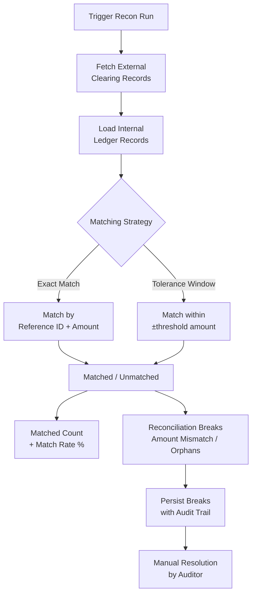

---

## 10. Microservices Communication Map

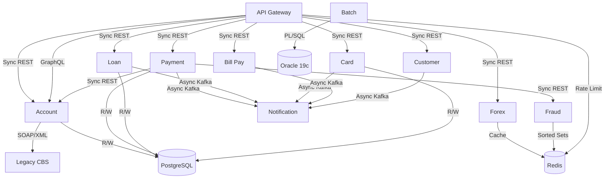

---

> 💡 **Interview Tip:** Open this file on your laptop before the interview. If the interviewer asks *"Can you draw the architecture?"* — you already have it ready. Walk through diagram #1 for the big picture, then zoom into #2 (Saga) or #5 (Outbox) based on what they ask.
