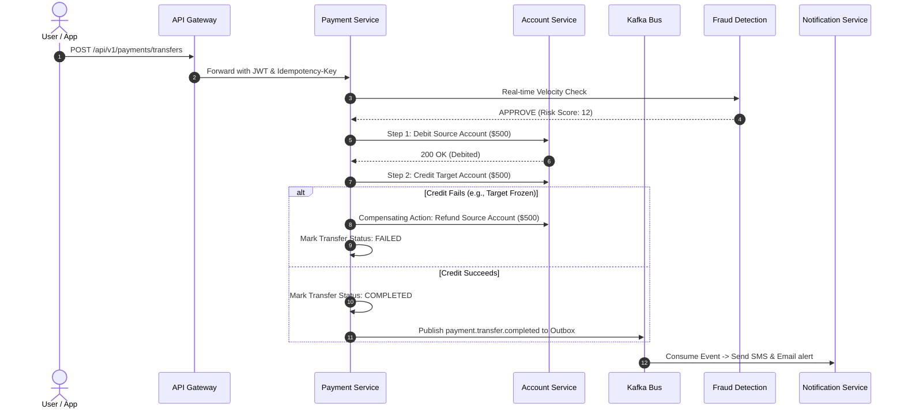

# 🎓 Enterprise Core Banking Platform: Fresher's Step-by-Step Learning Guide

Welcome to the **Enterprise Core Banking Microservices Ecosystem**! 

If you are a fresher or junior developer looking at this repository for the first time, an enterprise banking system with 11 microservices, Kafka, Redis, PostgreSQL, Oracle 19c PL/SQL, GraphQL, and SOAP can feel overwhelming.

Don't worry! This guide is designed specifically for you. It breaks down the entire project into a logical **"Follow the Money & Customer"** journey, explaining:
1. **Where to start first** and the recommended reading order.
2. **How real banking transactions work** behind the scenes.
3. **End-to-end sample flows with actual JSON requests and responses**.
4. **The industry design patterns** used in this project and why they exist.

---

## 🗺️ The Recommended 8-Step Learning Roadmap

Follow this exact sequence to build your mental model step-by-step:

```mermaid
flowchart LR
    Step1["1. Common Lib\n(banking-common)"] --> Step2["2. Customer & KYC\n(customer-service)"]
    Step2 --> Step3["3. Account & Ledger\n(account-service)"]
    Step3 --> Step4["4. Global FX Rates\n(exchange-rate-service)"]
    Step4 --> Step5["5. Payments & Saga\n(payment-service)"]
    Step5 --> Step6["6. Fraud & Risk\n(fraud-detection)"]
    Step6 --> Step7["7. Notifications\n(notification-service)"]
    Step7 --> Step8["8. Statements & Recon\n(reporting & batch)"]
```



| Step | Service | What You Learn Here | Time to Spend |
| :---: | :--- | :--- | :---: |
| **1** | [**banking-common**](file:///d:/Projects/Resume_Project/banking-common) | Base DTOs, AES-256-GCM encryption, PCI masking, Idempotency | 1 hour |
| **2** | [**customer-service**](file:///d:/Projects/Resume_Project/customer-service) | Customer onboarding, KYC documents, beneficiary cooling period | 1.5 hours |
| **3** | [**account-service**](file:///d:/Projects/Resume_Project/account-service) | Checking/Savings balance ledger, GraphQL API, Legacy CBS SOAP Bridge | 2 hours |
| **4** | [**exchange-rate-service**](file:///d:/Projects/Resume_Project/exchange-rate-service) | ISO currencies, country IBAN rules, real-time dynamic FX market ticker | 1 hour |
| **5** | [**payment-service**](file:///d:/Projects/Resume_Project/payment-service) | Multi-rail transfers (UPI, NEFT, IMPS, Cards, FX), 2-Phase Saga, Outbox | 3 hours |
| **6** | [**fraud-detection-service**](file:///d:/Projects/Resume_Project/fraud-detection-service) | Velocity rules, sliding-window Redis sorted sets, risk score engine | 1.5 hours |
| **7** | [**notification-service**](file:///d:/Projects/Resume_Project/notification-service) | Kafka event listeners, multi-channel dispatch (SMS, Email, Push) | 1 hour |
| **8** | [**reporting-service**](file:///d:/Projects/Resume_Project/reporting-service) & [**batch-service**](file:///d:/Projects/Resume_Project/batch-service) | PDF/Excel/CSV exports, Oracle 19c PL/SQL batching, automated reconciliation | 2 hours |

---

## 🚶 Step 1: Start with the Foundation (`banking-common`)

**Why start here?** Every microservice depends on this shared library. It contains no database tables, just clean reusable utilities and contracts.

### Key Files to Read:
1. [`DataMaskingUtil.java`](file:///d:/Projects/Resume_Project/banking-common/src/main/java/com/banking/common/crypto/DataMaskingUtil.java):
   - Shows PCI-DSS and GDPR compliant masking.
   - Example: A card number `4111111111111234` becomes `4111-XXXX-XXXX-1234`.
2. [`AesGcmCryptoService.java`](file:///d:/Projects/Resume_Project/banking-common/src/main/java/com/banking/common/crypto/AesGcmCryptoService.java):
   - Encrypts sensitive personally identifiable information (PII like Passports, SSNs, National IDs) using **AES-256-GCM** with a fresh 96-bit random Initialization Vector (IV).
3. [`EncryptedStringConverter.java`](file:///d:/Projects/Resume_Project/banking-common/src/main/java/com/banking/common/crypto/EncryptedStringConverter.java):
   - Transparent JPA converter: when an entity saves to DB, it encrypts; when it reads from DB, it decrypts.
4. [`IdempotencyAspect.java`](file:///d:/Projects/Resume_Project/banking-common/src/main/java/com/banking/common/idempotency/IdempotencyAspect.java):
   - Prevents double-charging if a user clicks "Pay" twice by caching the `Idempotency-Key` in Redis.

---

## 🚶 Step 2: Customer Onboarding & KYC (`customer-service`)

**Business Story:** A new user cannot do anything in a bank until they open a customer profile, submit identity proof (KYC), and add beneficiaries.

### Key Files to Read:
1. [`Customer.java`](file:///d:/Projects/Resume_Project/customer-service/src/main/java/com/banking/customer/domain/Customer.java): The customer record with status (`ACTIVE`, `SUSPENDED`).
2. [`CustomerKyc.java`](file:///d:/Projects/Resume_Project/customer-service/src/main/java/com/banking/customer/domain/CustomerKyc.java): Notice `@Convert(converter = EncryptedStringConverter.class)` on `idNumber`. In the database, the ID is encrypted!
3. [`Beneficiary.java`](file:///d:/Projects/Resume_Project/customer-service/src/main/java/com/banking/customer/domain/Beneficiary.java): Contains the **Cooling-Off Period** (`coolingEndTime`). When you add a new payee, banks restrict high-value transfers for 4 to 24 hours to prevent fraud.

### Sample Walkthrough 1: Register Customer & Submit KYC
```http
POST http://localhost:8080/api/v1/customers
Content-Type: application/json

{
  "firstName": "Alexander",
  "lastName": "Hamilton",
  "email": "a.hamilton@banking-domain.com",
  "phone": "+12125550190",
  "dateOfBirth": "1985-01-11",
  "address": "55 Wall St, New York, NY 10005"
}
```
**Response:**
```json
{
  "success": true,
  "data": {
    "id": "CUST-001",
    "customerNumber": "CN-10001",
    "status": "ACTIVE"
  }
}
```

---

## 🚶 Step 3: Open an Account & Check Balance (`account-service`)

**Business Story:** With a valid `customerId`, the user opens a Checking or Savings account. This service maintains the double-entry accounting ledger.

### Key Files to Read:
1. [`Account.java`](file:///d:/Projects/Resume_Project/account-service/src/main/java/com/banking/account/domain/Account.java): Tracks `balance` (actual ledger money) and `availableBalance` (balance minus pending holds).
2. [`AccountService.java`](file:///d:/Projects/Resume_Project/account-service/src/main/java/com/banking/account/service/AccountService.java): Notice the `@Transactional` debit and credit methods.
3. [`AccountGraphQLController.java`](file:///d:/Projects/Resume_Project/account-service/src/main/java/com/banking/account/controller/AccountGraphQLController.java): Modern GraphQL query interface alongside REST.
4. [`LegacyCbsMiddlewareGatewayImpl.java`](file:///d:/Projects/Resume_Project/account-service/src/main/java/com/banking/account/middleware/LegacyCbsMiddlewareGatewayImpl.java): Enterprise SOA adapter mediating between Spring Boot and older Mainframe/Finacle systems using SOAP XML with Resilience4j circuit breakers.

### Sample Walkthrough 2: Open an Account
```http
POST http://localhost:8080/api/v1/accounts
Content-Type: application/json

{
  "customerId": "CUST-001",
  "accountType": "CHECKING",
  "currency": "USD",
  "initialDeposit": 10000.00
}
```
**Response:**
```json
{
  "success": true,
  "data": {
    "accountNumber": "US1000000001",
    "customerId": "CUST-001",
    "balance": 10000.00,
    "availableBalance": 10000.00,
    "currency": "USD",
    "status": "ACTIVE"
  }
}
```

### Sample Walkthrough 3: Query Balance via GraphQL
```http
POST http://localhost:8080/graphql
Content-Type: application/json

{
  "query": "{ accountByNumber(accountNumber: \"US1000000001\") { balance availableBalance currency status } }"
}
```
**Response:**
```json
{
  "data": {
    "accountByNumber": {
      "balance": 10000.00,
      "availableBalance": 10000.00,
      "currency": "USD",
      "status": "ACTIVE"
    }
  }
}
```

---

## 🚶 Step 4: Issue a Debit/Credit Card (`card-service`)

**Business Story:** Customers need cards linked to their bank account for ATM withdrawals and online shopping.

### Key Files to Read:
1. [`Card.java`](file:///d:/Projects/Resume_Project/card-service/src/main/java/com/banking/card/domain/Card.java): Entity storing encrypted PIN hash and card status.
2. [`CardService.java`](file:///d:/Projects/Resume_Project/card-service/src/main/java/com/banking/card/service/CardService.java): Notice `generateLuhnCardNumber()`—it creates authentic 16-digit card numbers satisfying the mathematical **ISO/IEC 7812 Luhn Checksum Algorithm**.

---

## 🚶 Step 5: Global Currencies & Foreign Exchange (`exchange-rate-service`)

**Business Story:** If a customer in the US sends USD to a beneficiary in Germany (EUR) or India (INR), what exchange rate applies?

### Key Files to Read:
1. [`DynamicForexRateEngine.java`](file:///d:/Projects/Resume_Project/exchange-rate-service/src/main/java/com/banking/exchange/service/DynamicForexRateEngine.java):
   - Simulates a real interbank forex market using Geometric Brownian Motion ticks every 30 seconds.
   - Computes Bid rate (buy from customer) and Ask rate (sell to customer) with bank spreads.
   - Provides guaranteed 60-second quote locks (`/quote`).

### Sample Walkthrough 4: Get a Live Cross-Currency Transfer Quote
```http
GET http://localhost:8080/api/v1/exchange-rates/quote?fromCurrency=USD&toCurrency=EUR&amount=1000.00
```
**Response:**
```json
{
  "success": true,
  "data": {
    "quoteId": "QTE-7A9B1C2D",
    "sourceCurrency": "USD",
    "targetCurrency": "EUR",
    "sourceAmount": 1000.00,
    "targetAmount": 924.08,
    "exchangeRate": 0.924075,
    "quoteExpiresAt": "2026-10-01T22:45:00Z"
  }
}
```

---

## 🚶 Step 6: Money Transfers & The Saga Orchestrator (`payment-service`)

**Business Story:** This is the heart of the banking platform. When a transfer happens, money must be safely debited from the source account and credited to the destination account across distributed microservices.

### Why not standard `@Transactional`?
In microservices, `account-service` and `payment-service` have separate databases! If the debit succeeds but the credit fails, a standard local transaction cannot roll back the remote database.

### The Solution: 2-Phase Saga Pattern + Transactional Outbox Pattern



### Key Files to Read:
1. [`PaymentSagaOrchestrator.java`](file:///d:/Projects/Resume_Project/payment-service/src/main/java/com/banking/payment/saga/PaymentSagaOrchestrator.java):
   - Orchestrates the 2-Phase Saga.
   - If the credit fails, it automatically issues a **compensating transaction** to refund the sender!
2. [`PaymentGatewayFactory.java`](file:///d:/Projects/Resume_Project/payment-service/src/main/java/com/banking/payment/gateway/PaymentGatewayFactory.java):
   - **Strategy & Factory Pattern**: Dynamically selects the transfer gateway (`UpiGatewayAdapter`, `NeftGatewayAdapter`, `ImpsGatewayAdapter`, `CardGatewayAdapter`, `PayPalGatewayAdapter`).
3. [`OutboxPublisher.java`](file:///d:/Projects/Resume_Project/payment-service/src/main/java/com/banking/payment/outbox/OutboxPublisher.java):
   - **Transactional Outbox Pattern**: Saves the Kafka event into the database table `outbox_events` in the exact same local database commit as the transfer. A background worker then pushes it to Kafka. This guarantees **zero message loss**, even if Kafka crashes during the transfer!

### Sample Walkthrough 5: Execute an Idempotent Fund Transfer
```http
POST http://localhost:8080/api/v1/payments/transfers
Content-Type: application/json
Idempotency-Key: TXN-IDEMP-982173491823

{
  "sourceAccount": "US1000000001",
  "targetAccount": "US2000000002",
  "amount": 500.00,
  "currency": "USD",
  "paymentRail": "INTERNAL",
  "narration": "Monthly rent share"
}
```
**Response:**
```json
{
  "success": true,
  "data": {
    "transferId": "TXN-7F89B10",
    "sagaId": "SAGA-4C5D6E",
    "sourceAccount": "US1000000001",
    "targetAccount": "US2000000002",
    "amount": 500.00,
    "currency": "USD",
    "status": "COMPLETED",
    "message": "Transfer processed and verified through 2-Phase Saga"
  }
}
```

---

## 🚶 Step 7: Fraud Detection & Notifications (`fraud` & `notification`)

### Fraud Detection (`fraud-detection-service`)
- **Key File:** [`RiskAssessmentService.java`](file:///d:/Projects/Resume_Project/fraud-detection-service/src/main/java/com/banking/fraud/service/RiskAssessmentService.java)
- Uses **Redis Sorted Sets (`ZADD`, `ZCOUNT`)** to calculate transaction velocity (e.g., how many transactions occurred in the last 60 seconds).
- Scores risk from 0 (Safe) to 100 (High Risk). Transactions over $10,000 or high velocity trigger an automatic `HOLD` or `REJECT`.

### Notifications (`notification-service`)
- **Key File:** [`PaymentEventConsumer.java`](file:///d:/Projects/Resume_Project/notification-service/src/main/java/com/banking/notification/kafka/PaymentEventConsumer.java)
- Consumes Kafka topic `banking.payment.transfers`.
- Automatically prepares and dispatches SMS, Email, and Push notifications to the customer.

---

## 🚶 Step 8: Statements, Export/Import & Clearing Recon (`reporting` & `batch`)

### Reporting Service (`reporting-service`)
- **Key File:** [`TransactionReportingFacade.java`](file:///d:/Projects/Resume_Project/reporting-service/src/main/java/com/banking/reporting/facade/TransactionReportingFacade.java)
- Uses the **Strategy Pattern** to export statements in 4 industry formats:
  - `PDF`: Formatted customer statement via OpenPDF.
  - `EXCEL`: Multi-column styled workbook via Apache POI 5.3 `.xlsx`.
  - `CSV`: RFC-4180 compliant comma-separated file.
  - `JSON`: RESTful data export.
- Also supports **Import**: Bulk upload of historical CSV/Excel transactions via [`ImportParserFactory.java`](file:///d:/Projects/Resume_Project/reporting-service/src/main/java/com/banking/reporting/importing/ImportParserFactory.java).

### Sample Walkthrough 6: Download Account Statement as PDF or Excel
```http
GET http://localhost:8080/api/v1/reports/export?accountNumber=US1000000001&format=PDF
```
Downloads: `statement_US1000000001.pdf`

```http
GET http://localhost:8080/api/v1/reports/export?accountNumber=US1000000001&format=EXCEL
```
Downloads: `statement_US1000000001.xlsx`

### Batch Clearing & Oracle 19c Reconciliation (`batch-service`)
- **Key Files:**
  - [`ClearingBatchJobConfig.java`](file:///d:/Projects/Resume_Project/batch-service/src/main/java/com/banking/batch/config/ClearingBatchJobConfig.java): Spring Batch 5 chunk-oriented processing streaming 500,000+ clearing records.
  - [`OracleProcedureService.java`](file:///d:/Projects/Resume_Project/batch-service/src/main/java/com/banking/batch/procedure/OracleProcedureService.java): Invokes Oracle 19c stored procedures (`PKG_BANKING_CORE.SP_ACCRUE_DAILY_SAVINGS_INTEREST` and `PKG_RECONCILIATION_ENGINE.SP_RUN_AUTOMATED_RECON`).
  - [`ExactReferenceReconciliationStrategy.java`](file:///d:/Projects/Resume_Project/batch-service/src/main/java/com/banking/batch/reconciliation/strategy/ExactReferenceReconciliationStrategy.java): Matches internal bank ledger records against external clearing feeds (Visa/Mastercard/SWIFT), isolating discrepancies into **Reconciliation Breaks** with automated resolution.

---

## 🏛️ Top 6 Design Patterns to Notice in this Codebase

As a fresher, understanding *why* a pattern is used will accelerate your career:

| Design Pattern | Where It Is Used | Why We Used It Here |
| :--- | :--- | :--- |
| **Strategy Pattern** | `PaymentGatewayFactory` & `ExportStrategyFactory` | Allows switching between payment rails (UPI, Card, NEFT) or export formats (PDF, Excel, CSV) without modifying existing code (Open/Closed Principle). |
| **Saga Pattern** | `PaymentSagaOrchestrator` | Solves the distributed transaction problem across multiple microservices without slow, blocking two-phase commits (2PC). |
| **Transactional Outbox** | `OutboxPublisher` & `outbox_events` table | Guarantees that database updates and Kafka message publishing succeed or fail together atomically. |
| **Facade Pattern** | `TransactionReportingFacade` & `ReconciliationFacade` | Hides complex subsystems behind a clean, simple 1-line API call for controllers. |
| **Decorator / AOP** | `IdempotencyAspect` (`@Idempotent`) | Cross-cutting concern: intercepts incoming requests and deduplicates network retries without cluttering business methods. |
| **Factory Pattern** | `ImportParserFactory` & `ReconciliationRuleFactory` | Instantiates appropriate parsers or reconciliation rule strategies based on file extensions or configuration. |

---

## 🚀 How to Run and Experiment Locally

### 1. Start Support Infrastructure
In your terminal, start the required containers (PostgreSQL, Redis, Kafka, Keycloak):
```bash
docker compose up -d banking-db banking-redis banking-kafka banking-keycloak
```

### 2. Run a Microservice Locally
Pick any service to start experimenting with, for example `account-service`:
```bash
mvn spring-boot:run -pl account-service
```

### 3. Explore Interactive Swagger Documentation
Open your browser and test APIs interactively:
- **API Gateway**: [http://localhost:8080/swagger-ui.html](http://localhost:8080/swagger-ui.html)
- **Account Service**: [http://localhost:8081/swagger-ui.html](http://localhost:8081/swagger-ui.html)
- **Payment Service**: [http://localhost:8082/swagger-ui.html](http://localhost:8082/swagger-ui.html)
- **Exchange Rates**: [http://localhost:8083/swagger-ui.html](http://localhost:8083/swagger-ui.html)
- **Customer Service**: [http://localhost:8084/swagger-ui.html](http://localhost:8084/swagger-ui.html)
- **Reporting Service**: [http://localhost:8089/swagger-ui.html](http://localhost:8089/swagger-ui.html)
- **Batch Service**: [http://localhost:8090/swagger-ui.html](http://localhost:8090/swagger-ui.html)

---

## 💡 Quick Tips for Freshers
1. **Always look for the Flyway migration files** in `src/main/resources/db/migration/` of each service first. Reading the database table schema will immediately reveal the business domain.
2. **Follow the logs**: Every microservice outputs structured logs with correlation IDs. Follow the `X-Correlation-ID` header across services to trace a request end-to-end!
3. **Inspect the sample seed data**: All services include sample data in `V2` or `V3` migrations, so you can immediately test with accounts like `US1000000001` without manual setup.
