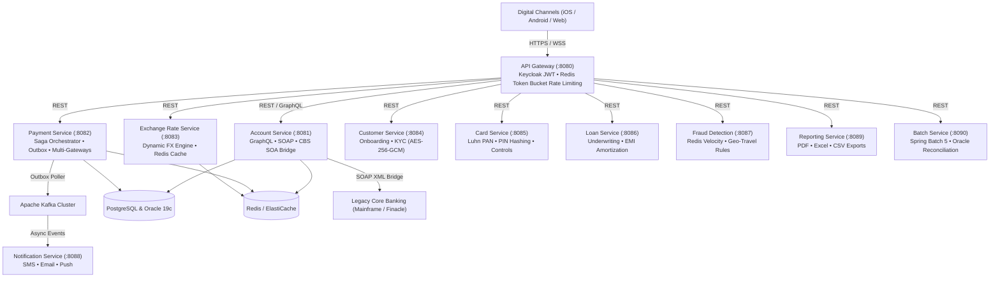

# 🏦 Enterprise Core Banking Microservices Platform

[](https://openjdk.org/projects/jdk/21/)
[](https://spring.io/projects/spring-boot)
[](https://spring.io/projects/spring-cloud)
[](https://kafka.apache.org/)
[](https://kubernetes.io/)
[](https://aws.amazon.com/)

A production-grade core banking platform built with **Java 21 Virtual Threads**, **Spring Boot 3.3**, and **Spring Cloud Gateway**, engineered for low-latency financial transactions, multi-rail payments, automated reconciliation, and legacy mainframe interoperability.

> 💡 **New to the project or looking to understand the full flow?** Check out the [**Fresher's Step-by-Step Learning Guide**](file:///d:/Projects/Resume_Project/BEGINNER_LEARNING_GUIDE.md) covering the recommended reading order, end-to-end sample requests, and design patterns.

---

## 🏛️ System Architecture



---

## 📦 Microservices Directory

| Service | Port | Primary Responsibilities | Key Tech Stack |
| :--- | :---: | :--- | :--- |
| [**api-gateway**](file:///d:/Projects/Resume_Project/api-gateway) | `8080` | Keycloak JWT Auth, RBAC, Redis Token-Bucket rate limiting | Spring Cloud Gateway, WebFlux, Redis |
| [**account-service**](file:///d:/Projects/Resume_Project/account-service) | `8081` | Ledger balance, GraphQL API, CBS SOA Middleware Bridge | Spring Data JPA, GraphQL, Spring-WS SOAP |
| [**payment-service**](file:///d:/Projects/Resume_Project/payment-service) | `8082` | Distributed fund transfers, 2-phase Saga, Multi-rail gateways | Kafka, Outbox Pattern, Strategy Pattern |
| [**exchange-rate-service**](file:///d:/Projects/Resume_Project/exchange-rate-service) | `8083` | Global currencies, dynamic interbank FX ticker, quotes | Redis Cache, Scheduled Brownian motion |
| [**customer-service**](file:///d:/Projects/Resume_Project/customer-service) | `8084` | Digital onboarding, KYC lifecycle, Beneficiary cooling-off | AES-256-GCM Crypto, Flyway |
| [**loan-service**](file:///d:/Projects/Resume_Project/loan-service) | `8085` | Loan underwriting, mathematical EMI formula, amortization | Spring Data JPA, Amortization Math |
| [**card-service**](file:///d:/Projects/Resume_Project/card-service) | `8086` | Debit/Credit issuance, Luhn check digit, PIN hashing | SHA-256, PCI-DSS Masking |
| [**fraud-detection-service**](file:///d:/Projects/Resume_Project/fraud-detection-service) | `8087` | Real-time sliding window velocity rules, risk decisions | Redis Sorted Sets, Risk Rule Engine |
| [**notification-service**](file:///d:/Projects/Resume_Project/notification-service) | `8088` | Omni-channel alerts (SMS, Email, Push FCM/APNS) | Kafka Consumer, Twilio/SendGrid mock |
| [**reporting-service**](file:///d:/Projects/Resume_Project/reporting-service) | `8089` | Statement export (PDF, Excel, CSV, JSON) and import | OpenPDF, Apache POI 5.3, Strategy Pattern |
| [**batch-service**](file:///d:/Projects/Resume_Project/batch-service) | `8090` | High-volume clearing ingestion, Oracle PL/SQL, reconciliation | Spring Batch 5, Oracle 19c PL/SQL |
| [**banking-common**](file:///d:/Projects/Resume_Project/banking-common) | - | Shared DTOs, AES-GCM crypto, masking util, `@Idempotent` | Reusable Java 21 Enterprise Library |

---

## ⚡ Quick Start

### 1. Launch Infrastructure
```bash
docker compose up -d banking-db banking-redis banking-kafka banking-keycloak banking-prometheus banking-grafana
```

### 2. Build Solution
```bash
mvn clean install -DskipTests
```

### 3. Run Microservices
```bash
# Terminal 1: API Gateway
mvn spring-boot:run -pl api-gateway

# Terminal 2: Account Service (Core Ledger & CBS Bridge)
mvn spring-boot:run -pl account-service

# Terminal 3: Payment Service (Transfers & Saga)
mvn spring-boot:run -pl payment-service

# Terminal 4: Forex Service (Dynamic Rates)
mvn spring-boot:run -pl exchange-rate-service
```

---

## 💡 Core Banking Capabilities

- **Multi-Rail Payment Gateways:** Strategy Pattern implementation for **UPI** (VPA/RRN), **Cards** (3DS/Luhn), **NetBanking** (NEFT, RTGS, IMPS), and **PayPal**.
- **Distributed Saga & Outbox:** At-least-once transactional Kafka event publishing with automated compensation debit/credit rollbacks.
- **Legacy CBS SOA Middleware:** Acts as an enterprise integration adapter bridging modern REST/GraphQL microservices to legacy Core Banking mainframes via SOAP XML envelopes with WS-Security headers and Resilience4j circuit breakers.
- **Global Currencies & Dynamic FX:** ISO-4217 world currencies and ISO-3166 countries with IBAN/SWIFT validation, live interbank rate fluctuations with Bid/Ask spreads, and 60-second guaranteed quotes.
- **Automated Clearing Reconciliation:** Automated matching between core ledgers and external clearing feeds with Exact Match and Tolerance Window rules, break tracking, and audit resolution workflows.
- **Data Encryption & PCI-DSS Masking:** AES-256-GCM attribute encryption for sensitive KYC identification numbers, combined with centralized masking for PANs, account numbers, and emails.

---

## 🔍 Interactive API Testing (Swagger & Actuator)

| Microservice | Interactive Swagger UI | Health Check |
| :--- | :--- | :--- |
| **API Gateway** | [http://localhost:8080/swagger-ui.html](http://localhost:8080/swagger-ui.html) | [http://localhost:8080/actuator/health](http://localhost:8080/actuator/health) |
| **Account Service** | [http://localhost:8081/swagger-ui.html](http://localhost:8081/swagger-ui.html) | [http://localhost:8081/actuator/health](http://localhost:8081/actuator/health) |
| **Payment Service** | [http://localhost:8082/swagger-ui.html](http://localhost:8082/swagger-ui.html) | [http://localhost:8082/actuator/health](http://localhost:8082/actuator/health) |
| **Exchange Rate Service**| [http://localhost:8083/swagger-ui.html](http://localhost:8083/swagger-ui.html) | [http://localhost:8083/actuator/health](http://localhost:8083/actuator/health) |
| **Reporting Service** | [http://localhost:8089/swagger-ui.html](http://localhost:8089/swagger-ui.html) | [http://localhost:8089/actuator/health](http://localhost:8089/actuator/health) |
| **Batch Service** | [http://localhost:8090/swagger-ui.html](http://localhost:8090/swagger-ui.html) | [http://localhost:8090/actuator/health](http://localhost:8090/actuator/health) |
| **Grafana Dashboards** | [http://localhost:3000](http://localhost:3000) (admin / admin) | Prometheus Metrics at `:9090` |

---

## 🛠️ API & Cloud Deep Dive (Click to Expand)

<details>
<summary><b>1. Multi-Format Statement Exports (PDF, Excel, CSV)</b></summary>

```bash
# Export PDF Statement with bank headers & styling
curl -X GET "http://localhost:8080/api/v1/reports/transactions/export?accountNumber=US1000000001&format=PDF" \
  -H "Authorization: Bearer <KEYCLOAK_JWT>" -o statement.pdf

# Export Excel .xlsx Statement with formulas
curl -X GET "http://localhost:8080/api/v1/reports/transactions/export?accountNumber=US1000000001&format=EXCEL" \
  -H "Authorization: Bearer <KEYCLOAK_JWT>" -o statement.xlsx
```
</details>

<details>
<summary><b>2. Dynamic Foreign Exchange & Beneficiary Validation</b></summary>

```bash
# Query ISO-4217 world currencies
curl -X GET http://localhost:8080/api/v1/exchange-rates/currencies

# Validate International Beneficiary IBAN & SWIFT
curl -X POST http://localhost:8080/api/v1/exchange-rates/validate-beneficiary \
  -H "Content-Type: application/json" \
  -d '{"countryCode":"DE","currencyCode":"EUR","accountNumberOrIban":"DE89370400440532013000","swiftBic":"DEUTDEDDFXX"}'

# Simulate live interbank rate fluctuation tick
curl -X POST http://localhost:8080/api/v1/exchange-rates/fluctuate
```
</details>

<details>
<summary><b>3. Automated Reconciliation & Break Resolution</b></summary>

```bash
# Trigger reconciliation run (EXACT_MATCH or TOLERANCE_WINDOW)
curl -X POST "http://localhost:8080/api/v1/reconciliation/run?ruleType=EXACT_MATCH"

# Query open reconciliation breaks
curl -X GET http://localhost:8080/api/v1/reconciliation/breaks/open

# Resolve break with audit notes
curl -X POST http://localhost:8080/api/v1/reconciliation/breaks/<BREAK_ID>/resolve \
  -H "Content-Type: application/json" \
  -d '{"resolutionStatus":"RESOLVED","resolvedBy":"AUDITOR_101","notes":"Intermediary fee adjusted"}'
```
</details>

<details>
<summary><b>4. Oracle 19c PL/SQL Procedures & High-Volume Batch</b></summary>

```bash
# Run Oracle Bulk Interest Accrual (BULK COLLECT & FORALL)
curl -X POST "http://localhost:8080/api/v1/batch/oracle/accrue-interest?batchSize=5000"

# Run Oracle End-Of-Day (EOD) Double-Entry Zero-Sum Reconciliation
curl -X POST "http://localhost:8080/api/v1/batch/oracle/reconcile-eod?date=2026-10-01"
```
</details>

<details>
<summary><b>5. AWS Cloud Deployment (Terraform & Helm)</b></summary>

- **Terraform IaC:** [`aws/terraform/`](file:///d:/Projects/Resume_Project/aws/terraform/) provisions VPC across 3 AZs, EKS 1.30, RDS Aurora PostgreSQL & Oracle 19c, ElastiCache Redis, MSK Kafka, and S3 KMS vault.
- **Kubernetes Helm:** [`helm/banking-platform/`](file:///d:/Projects/Resume_Project/helm/banking-platform/) defines zero-downtime rolling deployments, Horizontal Pod Autoscalers (HPA 3 to 30 pods), Pod Disruption Budgets, and AWS ALB Ingress.
</details>
