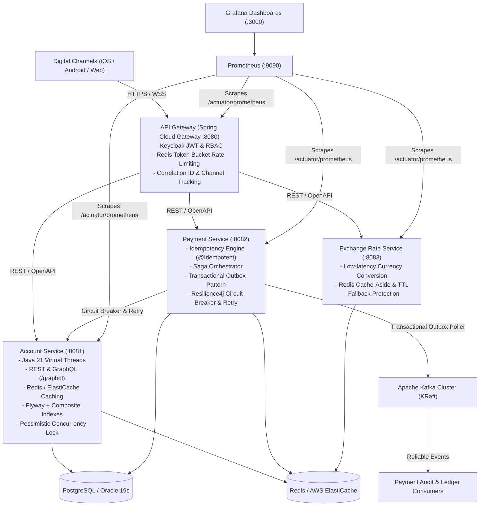

# Core Banking Microservices Platform

A production-grade, enterprise financial microservices ecosystem built with **Java 21**, **Spring Boot 3.3.4**, **Spring Cloud Gateway**, **Apache Kafka**, **Redis / AWS ElastiCache**, **PostgreSQL / Oracle 19c**, and deployed to **Kubernetes / AWS EKS**.

---

## 🏛️ Architecture Overview



---

## 🚀 Mapping to Core Banking Resume Highlights

| Resume / Project Module | Tech Stack & Capabilities | Codebase Implementation Location |
| :--- | :--- | :--- |
| **High-Throughput REST & GraphQL Core Banking APIs** | Java 21, Spring Boot 3.3, Virtual Threads, GraphQL, OpenAPI 3 | [`AccountRestController`](file:///d:/Projects/Resume_Project/account-service/src/main/java/com/banking/account/controller/AccountRestController.java), [`AccountGraphQLController`](file:///d:/Projects/Resume_Project/account-service/src/main/java/com/banking/account/controller/AccountGraphQLController.java) |
| **Legacy CBS SOAP Web Services & Oracle 19c PL/SQL** | Spring-WS, WSDL, XSD, Oracle 19c PL/SQL Bulk Collect & FORALL | [`AccountSoapEndpoint`](file:///d:/Projects/Resume_Project/account-service/src/main/java/com/banking/account/soap/AccountSoapEndpoint.java), [`PKG_BANKING_CORE.sql`](file:///d:/Projects/Resume_Project/account-service/src/main/resources/db/oracle/PKG_BANKING_CORE.sql) |
| **Digital Customer Onboarding & KYC Management** | Spring Data JPA, Flyway, Document Verification, Risk Tiers | [`CustomerService`](file:///d:/Projects/Resume_Project/customer-service/src/main/java/com/banking/customer/service/CustomerService.java), [`CustomerKycService`](file:///d:/Projects/Resume_Project/customer-service/src/main/java/com/banking/customer/service/CustomerKycService.java) |
| **Beneficiary Management & 4-Hour Cooling Periods** | Transaction Caps, Cooling Windows, Intra/Inter-Bank Routing | [`BeneficiaryService`](file:///d:/Projects/Resume_Project/customer-service/src/main/java/com/banking/customer/service/BeneficiaryService.java) |
| **Multi-Channel Payments (UPI, Cards, NetBanking, PayPal)** | Strategy Pattern, Luhn Algorithm, 3DS, VPA/RRN, NEFT/RTGS/IMPS | [`PaymentGatewayManager`](file:///d:/Projects/Resume_Project/payment-service/src/main/java/com/banking/payment/gateway/PaymentGatewayManager.java), [`UpiPaymentProcessor`](file:///d:/Projects/Resume_Project/payment-service/src/main/java/com/banking/payment/gateway/processors/UpiPaymentProcessor.java), [`CardPaymentProcessor`](file:///d:/Projects/Resume_Project/payment-service/src/main/java/com/banking/payment/gateway/processors/CardPaymentProcessor.java), [`NetBankingPaymentProcessor`](file:///d:/Projects/Resume_Project/payment-service/src/main/java/com/banking/payment/gateway/processors/NetBankingPaymentProcessor.java), [`PayPalPaymentProcessor`](file:///d:/Projects/Resume_Project/payment-service/src/main/java/com/banking/payment/gateway/processors/PayPalPaymentProcessor.java) |
| **Distributed Saga Orchestration & Transactional Outbox** | Apache Kafka (KRaft), Saga Orchestration, Outbox Poller, At-Least-Once | [`TransferSagaOrchestrator`](file:///d:/Projects/Resume_Project/payment-service/src/main/java/com/banking/payment/saga/TransferSagaOrchestrator.java), [`OutboxPollerService`](file:///d:/Projects/Resume_Project/payment-service/src/main/java/com/banking/payment/outbox/OutboxPollerService.java) |
| **Loan Management, Underwriting & EMI Amortization** | Mathematical EMI formula, Approval Lifecycle, Disbursal Schedule | [`LoanService`](file:///d:/Projects/Resume_Project/loan-service/src/main/java/com/banking/loan/service/LoanService.java), [`LoanController`](file:///d:/Projects/Resume_Project/loan-service/src/main/java/com/banking/loan/controller/LoanController.java) |
| **Debit & Credit Cards & Security Controls** | Luhn PAN Generator, Contactless/International toggles, PIN hashing | [`CardService`](file:///d:/Projects/Resume_Project/card-service/src/main/java/com/banking/card/service/CardService.java), [`CardController`](file:///d:/Projects/Resume_Project/card-service/src/main/java/com/banking/card/controller/CardController.java) |
| **Real-Time Fraud Detection & Risk Management** | Redis Sliding Window Velocity, Impossible Travel Anomaly, Scoring Rules | [`FraudRuleEngine`](file:///d:/Projects/Resume_Project/fraud-detection-service/src/main/java/com/banking/fraud/service/FraudRuleEngine.java), [`FraudDetectionController`](file:///d:/Projects/Resume_Project/fraud-detection-service/src/main/java/com/banking/fraud/controller/FraudDetectionController.java) |
| **Omni-Channel Customer Notifications & Audit Logging** | SMS, Email, Mobile Push (FCM/APNS), Kafka Consumer, Regulatory Audit | [`NotificationManager`](file:///d:/Projects/Resume_Project/notification-service/src/main/java/com/banking/notification/service/NotificationManager.java), [`NotificationKafkaConsumer`](file:///d:/Projects/Resume_Project/notification-service/src/main/java/com/banking/notification/kafka/NotificationKafkaConsumer.java) |
| **Transaction History, Statements & Turnover Analytics** | Multi-criteria filtering, CSV Ledger Export, Cash Flow Summaries | [`ReportingService`](file:///d:/Projects/Resume_Project/reporting-service/src/main/java/com/banking/reporting/service/ReportingService.java), [`ReportingController`](file:///d:/Projects/Resume_Project/reporting-service/src/main/java/com/banking/reporting/controller/ReportingController.java) |
| **Transaction History Multi-Format Export (PDF, Excel, CSV, JSON)** | OpenPDF, Apache POI 5.3, Strategy Pattern, Factory Pattern, Facade Pattern | [`TransactionReportingFacade`](file:///d:/Projects/Resume_Project/reporting-service/src/main/java/com/banking/reporting/facade/TransactionReportingFacade.java), [`ExportStrategyFactory`](file:///d:/Projects/Resume_Project/reporting-service/src/main/java/com/banking/reporting/export/ExportStrategyFactory.java), [`PdfExportStrategy`](file:///d:/Projects/Resume_Project/reporting-service/src/main/java/com/banking/reporting/export/strategies/PdfExportStrategy.java), [`ExcelExportStrategy`](file:///d:/Projects/Resume_Project/reporting-service/src/main/java/com/banking/reporting/export/strategies/ExcelExportStrategy.java) |
| **Transaction History Multi-Format Import (Excel .xlsx, CSV)** | Apache POI, CSV parser, Batch validation, Strategy Pattern | [`ImportParserFactory`](file:///d:/Projects/Resume_Project/reporting-service/src/main/java/com/banking/reporting/importing/ImportParserFactory.java), [`ExcelTransactionImportParser`](file:///d:/Projects/Resume_Project/reporting-service/src/main/java/com/banking/reporting/importing/parsers/ExcelTransactionImportParser.java), [`CsvTransactionImportParser`](file:///d:/Projects/Resume_Project/reporting-service/src/main/java/com/banking/reporting/importing/parsers/CsvTransactionImportParser.java) |
| **Automated Clearing Reconciliation & Break Resolution** | Strategy & Factory Patterns, Tolerance Windows, Break Tracking & Audit | [`ReconciliationFacade`](file:///d:/Projects/Resume_Project/batch-service/src/main/java/com/banking/batch/reconciliation/facade/ReconciliationFacade.java), [`ReconciliationRuleFactory`](file:///d:/Projects/Resume_Project/batch-service/src/main/java/com/banking/batch/reconciliation/factory/ReconciliationRuleFactory.java), [`ExactReferenceReconciliationStrategy`](file:///d:/Projects/Resume_Project/batch-service/src/main/java/com/banking/batch/reconciliation/strategy/ExactReferenceReconciliationStrategy.java), [`ToleranceWindowReconciliationStrategy`](file:///d:/Projects/Resume_Project/batch-service/src/main/java/com/banking/batch/reconciliation/strategy/ToleranceWindowReconciliationStrategy.java) |
| **Data Encryption Policies (At Rest & In Transit)** | AES-256-GCM Column Encryption Converter, PCI-DSS / GDPR Masking Util | [`AesGcmCryptoService`](file:///d:/Projects/Resume_Project/banking-common/src/main/java/com/banking/common/crypto/AesGcmCryptoService.java), [`EncryptedStringConverter`](file:///d:/Projects/Resume_Project/banking-common/src/main/java/com/banking/common/crypto/EncryptedStringConverter.java), [`DataMaskingUtil`](file:///d:/Projects/Resume_Project/banking-common/src/main/java/com/banking/common/crypto/DataMaskingUtil.java) |
| **Spring Batch & High-Volume File Ingestion** | Spring Batch 5, Multi-threaded Chunk Processing, Oracle PL/SQL MERGE | [`ClearingBatchJobConfig`](file:///d:/Projects/Resume_Project/batch-service/src/main/java/com/banking/batch/config/ClearingBatchJobConfig.java), [`OracleProcedureService`](file:///d:/Projects/Resume_Project/batch-service/src/main/java/com/banking/batch/procedure/OracleProcedureService.java) |
| **API Gateway, Security & Rate Limiting** | Spring Cloud Gateway, Keycloak OAuth2 JWT, Redis Token Bucket | [`SecurityConfig`](file:///d:/Projects/Resume_Project/api-gateway/src/main/java/com/banking/gateway/config/SecurityConfig.java), [`RateLimiterConfig`](file:///d:/Projects/Resume_Project/api-gateway/src/main/java/com/banking/gateway/ratelimit/RateLimiterConfig.java) |
| **Resilience & Fault Tolerance** | Resilience4j Circuit Breaker, Retries with backoff, Timeouts, Fallbacks | [`AccountClient`](file:///d:/Projects/Resume_Project/payment-service/src/main/java/com/banking/payment/client/AccountClient.java), [`ExchangeRateService`](file:///d:/Projects/Resume_Project/exchange-rate-service/src/main/java/com/banking/exchange/service/ExchangeRateService.java) |
| **Distributed Idempotency Engine** | Redis atomic setIfAbsent, SHA-256 Digest Verification, Result Caching | [`@Idempotent`](file:///d:/Projects/Resume_Project/banking-common/src/main/java/com/banking/common/idempotency/Idempotent.java), [`IdempotencyService`](file:///d:/Projects/Resume_Project/banking-common/src/main/java/com/banking/common/idempotency/IdempotencyService.java) |
| **Legacy CBS SOA Middleware & Canonical Adapter** | Spring-WS, SOAP XML, WS-Security Headers, Canonical Model, Circuit Breaker | [`LegacyCbsMiddlewareGateway`](file:///d:/Projects/Resume_Project/account-service/src/main/java/com/banking/account/middleware/LegacyCbsMiddlewareGateway.java), [`LegacyCbsMiddlewareController`](file:///d:/Projects/Resume_Project/account-service/src/main/java/com/banking/account/middleware/LegacyCbsMiddlewareController.java), [`CbsSoapEnvelopeBuilder`](file:///d:/Projects/Resume_Project/account-service/src/main/java/com/banking/account/middleware/CbsSoapEnvelopeBuilder.java) |
| **AWS Cloud Infrastructure as Code (Terraform)** | Terraform, AWS EKS 1.30, RDS Aurora & Oracle 19c, ElastiCache, MSK, S3 KMS | [`aws/terraform/`](file:///d:/Projects/Resume_Project/aws/terraform/), [`eks.tf`](file:///d:/Projects/Resume_Project/aws/terraform/eks.tf), [`rds.tf`](file:///d:/Projects/Resume_Project/aws/terraform/rds.tf), [`elasticache.tf`](file:///d:/Projects/Resume_Project/aws/terraform/elasticache.tf), [`msk.tf`](file:///d:/Projects/Resume_Project/aws/terraform/msk.tf) |
| **DevOps, Kubernetes (EKS), Docker & Helm** | Multi-stage Temurin 21 JRE, Helm Charts, HPA, PDB, Rolling Updates | [`Dockerfile`](file:///d:/Projects/Resume_Project/Dockerfile), [`helm/banking-platform/`](file:///d:/Projects/Resume_Project/helm/banking-platform/), [`docker-compose.yml`](file:///d:/Projects/Resume_Project/docker-compose.yml) |
| **CI/CD Automation & Code Quality** | GitHub Actions & Jenkins with SonarQube Quality Gate & OWASP Scan | [`.github/workflows/ci-cd.yml`](file:///d:/Projects/Resume_Project/.github/workflows/ci-cd.yml), [`Jenkinsfile`](file:///d:/Projects/Resume_Project/Jenkinsfile) |
| **Monitoring, Observability & RCA** | Actuator, Prometheus, Grafana, Splunk queries, AppDynamics APM | [`prometheus.yml`](file:///d:/Projects/Resume_Project/docker/prometheus/prometheus.yml), [`banking-metrics-dashboard.json`](file:///d:/Projects/Resume_Project/docker/grafana/provisioning/dashboards/banking-metrics-dashboard.json), [`PRODUCTION_SUPPORT_RCA_RUNBOOK.md`](file:///d:/Projects/Resume_Project/docs/PRODUCTION_SUPPORT_RCA_RUNBOOK.md) |

---

## 🎨 Enterprise Design Patterns in Action

| Design Pattern | Purpose & Implementation | Microservice Classes |
| :--- | :--- | :--- |
| **Strategy Pattern** | Pluggable algorithms for statement export (PDF, Excel, CSV, JSON), multi-format import parsers (.xlsx, .csv), payment rail processors (UPI, Cards, NetBanking, PayPal), and reconciliation matching rules (Exact vs. Tolerance). | [`TransactionExportStrategy`](file:///d:/Projects/Resume_Project/reporting-service/src/main/java/com/banking/reporting/export/TransactionExportStrategy.java), [`TransactionImportParser`](file:///d:/Projects/Resume_Project/reporting-service/src/main/java/com/banking/reporting/importing/TransactionImportParser.java), [`PaymentGatewayStrategy`](file:///d:/Projects/Resume_Project/payment-service/src/main/java/com/banking/payment/gateway/PaymentGatewayStrategy.java), [`ReconciliationRuleStrategy`](file:///d:/Projects/Resume_Project/batch-service/src/main/java/com/banking/batch/reconciliation/strategy/ReconciliationRuleStrategy.java) |
| **Facade Pattern** | Encapsulates complex subsystems into clean, single-point-of-entry business facades hiding multi-step transformations, queries, and external integrations. | [`TransactionReportingFacade`](file:///d:/Projects/Resume_Project/reporting-service/src/main/java/com/banking/reporting/facade/TransactionReportingFacade.java), [`ReconciliationFacade`](file:///d:/Projects/Resume_Project/batch-service/src/main/java/com/banking/batch/reconciliation/facade/ReconciliationFacade.java) |
| **Factory Pattern** | Decouples caller code from concrete strategy instances, providing instant resolution based on enums or runtime parameters. | [`ExportStrategyFactory`](file:///d:/Projects/Resume_Project/reporting-service/src/main/java/com/banking/reporting/export/ExportStrategyFactory.java), [`ImportParserFactory`](file:///d:/Projects/Resume_Project/reporting-service/src/main/java/com/banking/reporting/importing/ImportParserFactory.java), [`ReconciliationRuleFactory`](file:///d:/Projects/Resume_Project/batch-service/src/main/java/com/banking/batch/reconciliation/factory/ReconciliationRuleFactory.java), [`PaymentGatewayManager`](file:///d:/Projects/Resume_Project/payment-service/src/main/java/com/banking/payment/gateway/PaymentGatewayManager.java) |
| **Singleton Pattern** | Enforced across all microservices using Spring IoC singleton scope, immutability, thread-safe memory models, and constructor injection. | Default singleton lifecycle across all `@Service`, `@Component`, and `@Configuration` beans. |

---

## 🔐 Sensitive Data Encryption & Masking Policies

1. **Column-Level Attribute Encryption at Rest (AES-256-GCM):**
   - [`AesGcmCryptoService`](file:///d:/Projects/Resume_Project/banking-common/src/main/java/com/banking/common/crypto/AesGcmCryptoService.java) generates a cryptographically secure 96-bit random IV for every encryption call and performs Galois/Counter Mode authenticated encryption with integrity checking.
   - [`EncryptedStringConverter`](file:///d:/Projects/Resume_Project/banking-common/src/main/java/com/banking/common/crypto/EncryptedStringConverter.java) applies transparent JPA `@Convert` to sensitive entity fields like government identification numbers ([`CustomerKyc.idNumber`](file:///d:/Projects/Resume_Project/customer-service/src/main/java/com/banking/customer/domain/CustomerKyc.java)), preventing plaintext leaks in database dumps and logs.
2. **PCI-DSS & GDPR Masking Policies:**
   - [`DataMaskingUtil`](file:///d:/Projects/Resume_Project/banking-common/src/main/java/com/banking/common/crypto/DataMaskingUtil.java) enforces standardized masking across all API responses, reports, and UI exports:
     - **Credit / Debit Cards:** `4532-****-****-1098`
     - **Bank Accounts:** `****9012`
     - **Email Addresses:** `j***e@domain.com`
     - **SSN / National IDs:** `***-**-6789`

---

## ⚡ Quick Start: Running Locally

### 1. Start Infrastructure via Docker Compose
```bash
docker compose up -d banking-db banking-redis banking-kafka banking-keycloak banking-prometheus banking-grafana
```

### 2. Build the Complete Maven Multi-Module Project
```bash
mvn clean install -DskipTests
```

### 3. Run Microservices
```bash
# Terminal 1: API Gateway (:8080)
mvn spring-boot:run -pl api-gateway

# Terminal 2: Account Microservice (REST, SOAP CBS & GraphQL :8081)
mvn spring-boot:run -pl account-service

# Terminal 3: Payment Microservice (Saga Orchestration & Multi-Rail Gateway :8082)
mvn spring-boot:run -pl payment-service

# Terminal 4: Reporting & Export/Import Service (:8086)
mvn spring-boot:run -pl reporting-service

# Terminal 5: Spring Batch & Reconciliation Service (:8087)
mvn spring-boot:run -pl batch-service
```

---

## 🔒 Example API Operations

### 1. Multi-Format Transaction History Export (PDF, Excel, CSV, JSON)
```bash
# Export formatted PDF Statement with bank headers & styling
curl -X GET "http://localhost:8080/api/v1/reports/transactions/export?accountNumber=US1000000001&format=PDF" \
  -H "Authorization: Bearer <KEYCLOAK_JWT>" -o account_statement.pdf

# Export Excel .xlsx Statement with formulas and headers
curl -X GET "http://localhost:8080/api/v1/reports/transactions/export?accountNumber=US1000000001&format=EXCEL" \
  -H "Authorization: Bearer <KEYCLOAK_JWT>" -o account_statement.xlsx

# Export CSV format
curl -X GET "http://localhost:8080/api/v1/reports/transactions/export?accountNumber=US1000000001&format=CSV" \
  -H "Authorization: Bearer <KEYCLOAK_JWT>" -o account_statement.csv
```

### 2. Import External Clearing File (Excel / CSV)
```bash
curl -X POST http://localhost:8080/api/v1/reports/transactions/import \
  -H "Authorization: Bearer <KEYCLOAK_JWT>" \
  -F "file=@clearing_feed_daily.xlsx"
```

### 3. Run Automated Reconciliation Process
```bash
# Run reconciliation with EXACT_MATCH or TOLERANCE_WINDOW
curl -X POST "http://localhost:8080/api/v1/reconciliation/run?ruleType=EXACT_MATCH" \
  -H "Authorization: Bearer <KEYCLOAK_JWT>"

# View detected open breaks
curl -X GET "http://localhost:8080/api/v1/reconciliation/breaks/open" \
  -H "Authorization: Bearer <KEYCLOAK_JWT>"

# Resolve a detected break
curl -X POST "http://localhost:8080/api/v1/reconciliation/breaks/<BREAK_ID>/resolve" \
  -H "Content-Type: application/json" \
  -H "Authorization: Bearer <KEYCLOAK_JWT>" \
  -d '{
    "resolutionStatus": "RESOLVED",
    "resolvedBy": "AUDITOR_EMP_441",
    "notes": "Verified against Swift MT940 bank statement. Variance due to $1.25 clearing fee."
  }'
```

### 4. Initiate Idempotent Financial Fund Transfer
```bash
curl -X POST http://localhost:8080/api/v1/payments/transfer \
  -H "Content-Type: application/json" \
  -H "Idempotency-Key: 9b1deb4d-3b7d-4bad-9bdd-2b0d7b3dcb6d" \
  -H "X-Correlation-ID: c8f2a1b9-7d84-4e4b-9231-50e4177c8e99" \
  -H "X-Channel: IOS" \
  -H "Authorization: Bearer <KEYCLOAK_JWT_TOKEN>" \
  -d '{
    "sourceAccountNumber": "US1000000001",
    "targetAccountNumber": "US2000000002",
    "amount": 250.00,
    "currency": "USD"
  }'
```

### 5. Global Currencies, Country Codes & Dynamic FX Operations
```bash
# Query all ISO-4217 world currencies
curl -X GET http://localhost:8080/api/v1/exchange-rates/currencies \
  -H "Authorization: Bearer <KEYCLOAK_JWT>"

# Query all countries with IBAN rules, phone codes, and SWIFT prefixes
curl -X GET http://localhost:8080/api/v1/exchange-rates/countries \
  -H "Authorization: Bearer <KEYCLOAK_JWT>"

# Validate cross-border beneficiary (IBAN format check & currency compatibility)
curl -X POST http://localhost:8080/api/v1/exchange-rates/validate-beneficiary \
  -H "Content-Type: application/json" \
  -H "Authorization: Bearer <KEYCLOAK_JWT>" \
  -d '{
    "countryCode": "DE",
    "currencyCode": "EUR",
    "accountNumberOrIban": "DE89370400440532013000",
    "swiftBic": "DEUTDEDDFXX"
  }'

# Get live interbank rates with Bid, Ask, Mid, and Spread %
curl -X GET http://localhost:8080/api/v1/exchange-rates/live \
  -H "Authorization: Bearer <KEYCLOAK_JWT>"

# Lock guaranteed 60-second rate quote for fund transfer
curl -X POST http://localhost:8080/api/v1/exchange-rates/quote \
  -H "Content-Type: application/json" \
  -H "Authorization: Bearer <KEYCLOAK_JWT>" \
  -d '{
    "fromCurrency": "USD",
    "toCurrency": "EUR",
    "amount": 10000.00,
    "beneficiaryCountryCode": "DE"
  }'

# Trigger live market dynamic rate fluctuation tick (simulating Reuters/Bloomberg FX feed)
curl -X POST http://localhost:8080/api/v1/exchange-rates/fluctuate \
  -H "Authorization: Bearer <KEYCLOAK_JWT>"
```

### 6. Oracle 19c Enterprise PL/SQL Execution
```bash
# Invoke Oracle PL/SQL Bulk Interest Accrual (BULK COLLECT & FORALL)
curl -X POST "http://localhost:8080/api/v1/batch/oracle/accrue-interest?batchSize=5000" \
  -H "Authorization: Bearer <KEYCLOAK_JWT>"

# Invoke Oracle PL/SQL End-Of-Day (EOD) Double-Entry Zero-Sum Reconciliation
curl -X POST "http://localhost:8080/api/v1/batch/oracle/reconcile-eod?date=2026-10-01" \
  -H "Authorization: Bearer <KEYCLOAK_JWT>"
```

---

## 📊 Observability & Swagger Endpoints
- **Grafana Dashboards**: [http://localhost:3000](http://localhost:3000) (admin / admin)
- **Prometheus Scrapes**: [http://localhost:9090](http://localhost:9090)
- **Swagger Documentation**:
  - API Gateway: [http://localhost:8080/swagger-ui.html](http://localhost:8080/swagger-ui.html)
  - Account Service: [http://localhost:8081/swagger-ui.html](http://localhost:8081/swagger-ui.html)
  - Payment Service: [http://localhost:8082/swagger-ui.html](http://localhost:8082/swagger-ui.html)
  - Exchange Rate & Global Currencies: [http://localhost:8083/swagger-ui.html](http://localhost:8083/swagger-ui.html)
  - Reporting & Export Service: [http://localhost:8086/swagger-ui.html](http://localhost:8086/swagger-ui.html)
  - Batch & Reconciliation Service: [http://localhost:8087/swagger-ui.html](http://localhost:8087/swagger-ui.html)

