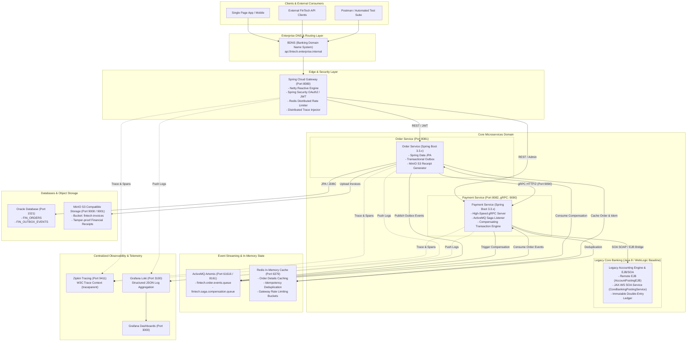
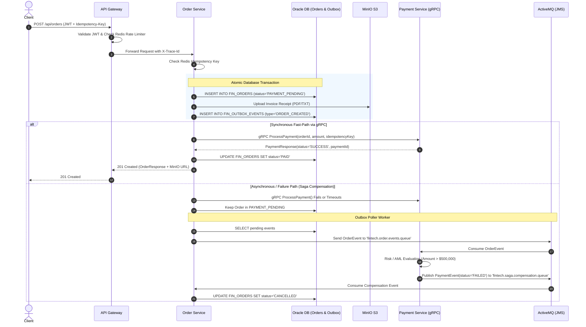

# Enterprise Microservices Architecture Specification

This document details the high-level architecture, distributed transaction model, distributed tracing, and data storage design for the **Fintech Enterprise Platform**, tailored to the technical standard of a **Senior Java Developer / Microservices Developer with 8+ years of experience**.

---

## 1. System Architecture Overview

---

## 2. Distributed Transactions: Transactional Outbox & Saga Pattern

In distributed financial architectures, **Two-Phase Commit (2PC)** introduces synchronous blocking and single points of failure that do not scale in cloud-native environments. This platform implements the **Transactional Outbox Pattern** combined with a **Choreographed / Orchestrated Saga**:

---

## 3. Distributed Tracing & Centralized Logging Flow

Every HTTP request entering the platform is assigned a unique `X-Trace-Id` (or adheres to W3C `traceparent` headers):
1. **API Gateway**: Generates or forwards `traceId` and propagates via HTTP headers.
2. **Micrometer Tracing + Brave**: Injects `traceId` and `spanId` into Slf4j MDC.
3. **Loki4j Appender**: Ships structured logs with trace metadata directly to Grafana Loki (`http://localhost:3100/loki/api/v1/push`).
4. **Grafana Trace-to-Log Correlation**: Engineers can jump directly from a slow Zipkin span into the exact Loki logs emitted by `api-gateway`, `order-service`, or `payment-service`.

---

## 4. Technology Stack Matrix

| Technology | Role in Architecture | Senior Architectural Decision / Justification |
| :--- | :--- | :--- |
| **Java 17 / 21** | Primary Language Baseline | LTS release offering records, sealed interfaces, enhanced GC, and modern JVM performance required by Spring Boot 3.x. |
| **Java 8** | Legacy Module Target | Showcases legacy system integration, backward-compatibility bridges, and migration mastery. |
| **Spring Boot 3.3.x** | Application Framework | Jakarta EE 10 baseline, native observability with Micrometer, robust security integration. |
| **Spring Cloud Gateway** | API Gateway & Edge Security | Reactive non-blocking I/O (Project Reactor/Netty), centralized OAuth2 resource server, distributed rate limiting. |
| **gRPC & Protobuf** | Synchronous Inter-Service IPC | Binary serialization over HTTP/2, schema-enforced contracts (`payment.proto`), low latency compared to REST. |
| **ActiveMQ (Artemis)** | Asynchronous Messaging & Saga | Enterprise JMS 2.0 broker for resilient, decoupled asynchronous saga orchestration and outbox event streaming. |
| **Redis Cache** | Distributed Cache & Locking | Fast in-memory store for `@Cacheable` order queries, distributed rate limiting, and idempotency deduplication keys. |
| **Oracle Database** | Relational Ledger Persistence | Enterprise ACID transactions with Sequence generators, indexed query execution, and transactional outbox persistence. |
| **MinIO** | S3-Compatible Object Storage | High-durability distributed storage for invoices and receipts with presigned temporary download URLs. |
| **Grafana Loki** | Centralized Log Aggregation | Label-based log indexing tightly integrated with Grafana, eliminating the operational overhead of full-text Elasticsearch clusters. |
| **Micrometer Tracing** | Distributed Tracing | Standardized vendor-neutral instrumentation exporting W3C spans to Zipkin/Jaeger. |
| **Docker & Kubernetes** | Containerization & Orchestration | Declarative deployments, liveness/readiness probes, HPA, and multi-stage container optimization. |
| **EJB (3.x Stateless)** | Legacy Core Banking Interop | Remote Stateless Session Beans (`AccountPostingEJB`) for WebLogic Core Banking ledger settlement. |
| **SOA / SOAP Web Services** | Legacy Core System Integration | JAX-WS Web Services and XML Anti-Corruption Layer (`LegacyCoreBankingSoaClient`) to communicate with Core Banking SOA Suite. |
| **BDNS** | Banking Domain Name Service | Enterprise intranet split-horizon DNS routing resolving banking services across network zones. |
