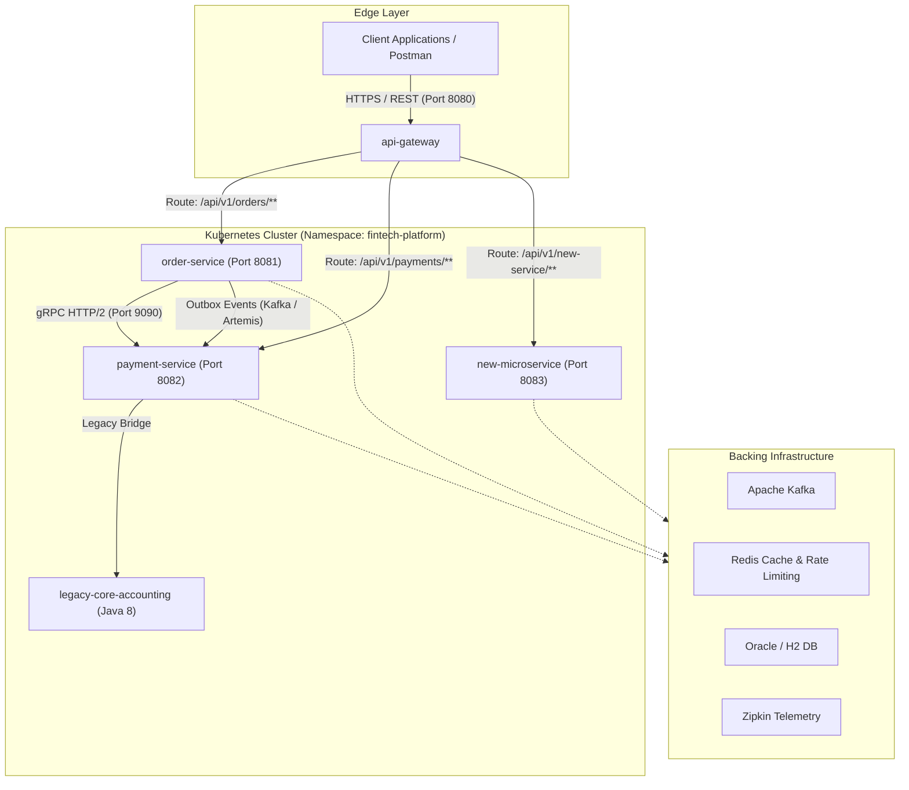

# Feature & Microservice End-to-End Development & Deployment Guide

This document provides a step-by-step developer and DevOps reference for adding a **new feature** to an existing service or introducing a **brand-new microservice** into the **Fintech Enterprise Platform**.

---

## Architecture Overview



---

# Part 1: Developing and Deploying a New Feature

Follow these steps when implementing a new API or business workflow within existing services (e.g. `order-service` or `payment-service`).

### Step 1: Define or Update Contracts (API-First / gRPC)
If the feature requires synchronous, low-latency inter-service communication:
1. **File to Modify**: `common-contracts/src/main/proto/payment.proto` (or create a new `.proto` definition in the same directory).
2. **Define Request/Response and RPC method**:
   ```protobuf
   message NewFeatureRequest {
     string account_id = 1;
     double amount = 2;
     string currency = 3;
   }

   message NewFeatureResponse {
     string status = 1;
     string transaction_reference = 2;
   }

   service PaymentService {
     rpc ProcessNewFeature (NewFeatureRequest) returns (NewFeatureResponse);
   }
   ```
3. **Compile Contracts**:
   ```bash
   mvn clean install -pl common-contracts
   ```
   *This automatically generates Java DTOs and gRPC stubs in `common-contracts/target/generated-sources/`.*

---

### Step 2: Implement Domain, Persistence, and Business Logic
In the target service (`order-service` or `payment-service`):

1. **DTOs (Data Transfer Objects)**:
   - **Path**: `src/main/java/com/enterprise/fintech/<module>/dto/`
   - Create request and response records/classes with validation annotations (`@NotBlank`, `@Positive`).
2. **Entity & Repository**:
   - **Path**: `src/main/java/com/enterprise/fintech/<module>/domain/`
   - **Path**: `src/main/java/com/enterprise/fintech/<module>/repository/`
   - Create the JPA entity and Spring Data repository interface.
3. **Service Layer (Business Logic & Transactions)**:
   - **Path**: `src/main/java/com/enterprise/fintech/<module>/service/`
   - Apply explicit transaction demarcation:
     ```java
     @Transactional(propagation = Propagation.REQUIRED, isolation = Isolation.READ_COMMITTED)
     public FeatureResult executeFeature(FeatureRequest request) {
         // 1. Idempotency validation with Redis
         // 2. Business validation & domain mutation
         // 3. Save Transactional Outbox event (if event-driven)
     }
     ```
4. **Controller or gRPC Handler**:
   - **REST API**: Create `src/main/java/com/enterprise/fintech/<module>/controller/FeatureController.java` with `@RestController` and `@RequestMapping("/api/v1/...")`.
   - **gRPC Service**: Implement the generated gRPC stub in `src/main/java/com/enterprise/fintech/payment/grpc/PaymentGrpcServiceImpl.java`.

---

### Step 3: Configure API Gateway Routing & Security
All incoming client traffic enters through the `api-gateway`.

1. **Route Definition**:
   - **File**: `api-gateway/src/main/resources/application.yml`
   - Add a route entry under `spring.cloud.gateway.routes`:
     ```yaml
     - id: new-feature-route
       uri: lb://order-service
       predicates:
         - Path=/api/v1/new-feature/**
       filters:
         - name: CircuitBreaker
           args:
             name: newFeatureCircuitBreaker
             fallbackUri: forward:/fallback/order
     ```
2. **Security Permissions**:
   - Verify JWT and OAuth2 authorization rules in `api-gateway/src/main/java/com/enterprise/fintech/gateway/security/SecurityConfig.java`.

---

### Step 4: Write Unit & Integration Tests
Every feature must have automated test coverage:
1. **Unit Tests**:
   - Create test in `src/test/java/com/enterprise/fintech/<module>/service/FeatureServiceTest.java`.
   - Use **JUnit 5** and **Mockito** to test core logic, edge cases, and exception handling.
2. **Verification Command**:
   ```bash
   mvn clean test
   ```

---

# Part 2: Creating and Deploying a Brand-New Microservice

Follow these steps when scaffolding an entirely new standalone microservice (e.g. `notification-service` or `settlement-service`).

### Step 1: Register in Root Maven Parent POM
Add the new module to the root build:
1. **File**: `pom.xml` (root)
2. **Add Sub-module**:
   ```xml
   <modules>
       <module>common-contracts</module>
       <module>api-gateway</module>
       <module>order-service</module>
       <module>payment-service</module>
       <module>legacy-core-accounting</module>
       <module>new-service</module>  <!-- Add here -->
   </modules>
   ```

---

### Step 2: Create the Microservice Module Directory Structure
Create directory: `new-service/` with standard Maven layout:
```
new-service/
├── pom.xml
└── src/
    ├── main/
    │   ├── java/com/enterprise/fintech/newservice/
    │   │   ├── NewServiceApplication.java
    │   │   ├── config/
    │   │   ├── controller/
    │   │   ├── domain/
    │   │   ├── repository/
    │   │   └── service/
    │   └── resources/
    │       ├── application.yml
    │       └── logback-spring.xml
    └── test/
        └── java/com/enterprise/fintech/newservice/
            └── NewServiceApplicationTest.java
```

1. **`new-service/pom.xml`**:
   - Inherit from root `com.enterprise.fintech:fintech-enterprise-platform:1.0.0-SNAPSHOT`.
   - Add dependencies: `spring-boot-starter-web`, `spring-boot-starter-data-jpa`, `spring-boot-starter-actuator`, `micrometer-tracing-bridge-brave`, `common-contracts`.
2. **`application.yml`**:
   - Assign unique server port (e.g. `server.port: 8083`).
   - Configure database, Kafka/JMS broker, and tracing endpoint.

---

### Step 3: Create Docker Container Definition
Create a dedicated Dockerfile:
1. **File**: `docker/Dockerfile.new-service`
   ```dockerfile
   FROM eclipse-temurin:21-jre-alpine
   VOLUME /tmp
   ARG JAR_FILE=new-service/target/*.jar
   COPY ${JAR_FILE} app.jar
   EXPOSE 8083
   ENTRYPOINT ["java", "-XX:+UseG1GC", "-XX:MaxRAMPercentage=75.0", "-jar", "/app.jar"]
   ```

2. **Add to Local Docker Compose**:
   - **File**: `docker/docker-compose.yml`
   - Add the service under `services:` so it can run alongside Redis, Kafka, and the other services locally.

---

### Step 4: Configure API Gateway
Direct client traffic to the new microservice:
1. **File**: `api-gateway/src/main/resources/application.yml`
2. **Add route**:
   ```yaml
   - id: new-service-route
     uri: lb://new-service
     predicates:
       - Path=/api/v1/new-service/**
   ```

---

### Step 5: Kubernetes Manifests (k8s/)
Create deployment and service definitions for cluster deployment:
1. **File to Create**: `k8s/new-service-deployment.yaml`
   ```yaml
   apiVersion: apps/v1
   kind: Deployment
   metadata:
     name: new-service
     namespace: fintech-platform
     labels:
       app: new-service
   spec:
     replicas: 2
     selector:
       matchLabels:
         app: new-service
     template:
       metadata:
         labels:
           app: new-service
       spec:
         containers:
           - name: new-service
             image: registry.enterprise.internal/new-service:latest
             imagePullPolicy: IfNotPresent
             ports:
               - containerPort: 8083
             resources:
               requests:
                 memory: "512Mi"
                 cpu: "250m"
               limits:
                 memory: "1Gi"
                 cpu: "1000m"
             readinessProbe:
               httpGet:
                 path: /actuator/health/readiness
                 port: 8083
               initialDelaySeconds: 20
               periodSeconds: 10
             livenessProbe:
               httpGet:
                 path: /actuator/health/liveness
                 port: 8083
               initialDelaySeconds: 30
               periodSeconds: 15
   ---
   apiVersion: v1
   kind: Service
   metadata:
     name: new-service
     namespace: fintech-platform
   spec:
     selector:
       app: new-service
     ports:
       - port: 8083
         targetPort: 8083
   ```
2. **Update Ingress**:
   - **File**: `k8s/ingress.yaml`
   - Add path `/api/v1/new-service` if exposed externally through Ingress.

---

# Part 3: CI/CD Pipeline & Production Deployment

The project automates builds, quality checks, and deployments via Jenkins and GitLab CI.

### Step 1: CI/CD Pipeline Updates
1. **Update [Jenkinsfile](file:///d:/Projects/FintechEnterprisePlatform/Jenkinsfile)**:
   - In stage `'Build & Push Docker Containers'`:
     ```groovy
     sh "docker build -f docker/Dockerfile.new-service -t ${DOCKER_REGISTRY}/new-service:${APP_VERSION} ."
     sh "docker push ${DOCKER_REGISTRY}/new-service:${APP_VERSION}"
     ```
   - In stage `'Deploy to Kubernetes'`:
     ```groovy
     sh "kubectl apply -f k8s/new-service-deployment.yaml"
     sh "kubectl rollout status deployment/new-service -n fintech-platform --timeout=120s"
     ```
2. **Update [.gitlab-ci.yml](file:///d:/Projects/FintechEnterprisePlatform/.gitlab-ci.yml)** *(if using GitLab)*:
   - Add parallel build and deploy jobs matching the pattern of `order-service`.

---

### Step 2: Deployment Execution Steps (Git Flow)

1. **Commit Code**:
   ```bash
   git checkout -b feature/FT-102-new-microservice
   git add .
   git commit -m "feat: implement new microservice and k8s manifests"
   git push origin feature/FT-102-new-microservice
   ```
2. **Pull Request & Automated Quality Gate**:
   - Pipeline triggers `mvn clean test jacoco:report`.
   - SonarQube analyzes code quality against thresholds.
   - Code review approval and merge to `main`.
3. **Automated Deployment**:
   - CI builds and tags Docker container with build number (`1.0.0-${BUILD_NUMBER}`).
   - Pushes container image to internal enterprise registry.
   - Applies Kubernetes manifests to namespace `fintech-platform`.
   - Executes rolling update with zero-downtime:
     ```bash
     kubectl rollout status deployment/new-service -n fintech-platform --timeout=120s
     ```

---

## Quick Reference: Checklist of Files

| Step | For a New Feature in Existing Service | For a Brand-New Microservice |
| :--- | :--- | :--- |
| **Contracts** | `common-contracts/src/main/proto/*.proto` *(if gRPC)* | `common-contracts/pom.xml` *(if shared)* |
| **Root Maven** | None | `pom.xml` (add `<module>`) |
| **Service Code** | DTOs, Entity, Repo, Service, Controller in existing module | Complete new module folder: `new-service/` |
| **Configuration** | Service `application.yml` | `new-service/src/main/resources/application.yml` |
| **API Gateway** | `api-gateway/.../application.yml` (add route) | `api-gateway/.../application.yml` (add route) |
| **Testing** | New JUnit 5 & Mockito test files | Service test suite + ApplicationTest |
| **Docker** | None (uses existing Dockerfile) | `docker/Dockerfile.new-service` + `docker-compose.yml` |
| **Kubernetes** | None | `k8s/new-service-deployment.yaml` + `k8s/ingress.yaml` |
| **CI/CD** | Automated on merge | `Jenkinsfile` / `.gitlab-ci.yml` build & deploy stages |
